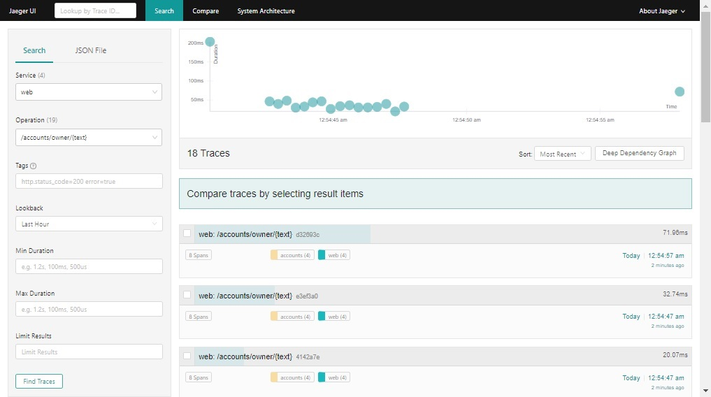
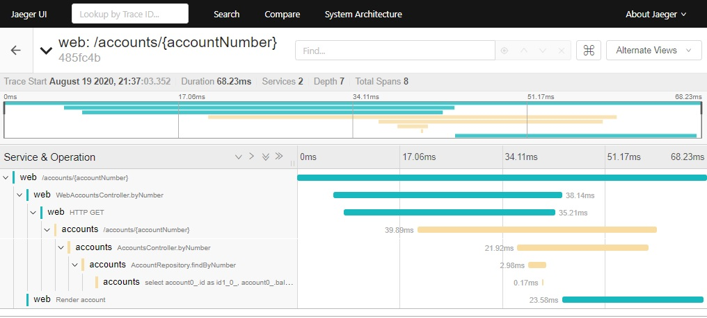

# Jaeger and OpenTelemetry end-to-end distributed tracing demo

This demo includes simple distributed microservice application  (based on https://github.com/paulc4/microservices-demo), and OpenTelemetry Java agent to collect traces and send it to the Jaeger.

### Procedure to run the demo

##### Docker procedure:

To run this demo, open a Linux terminal or Windows PowerShell and run these commands:

1. Build the application:

    `docker run -it --rm --name my-maven-project -v "$(pwd):/usr/src/mymaven" -w "/usr/src/mymaven" maven:3.3-jdk-8 mvn clean package`

2. Build Docker image: 

   `docker build -f opentelemetry.dockerfile -t erivelto1976/microservice-opentelemetry .` 

3. Run docker-compose up:  

   `docker-compose up` or `sudo docker-compose up`

##### Manual Procedure:

Prereqs: Apache Maven 3.6.3 and Openjdk version 1.8.0_121 

1. [Download Jaeger](https://www.jaegertracing.io/download/) for your OS

2. [Download OpenTelemetry Java agent](https://github.com/open-telemetry/opentelemetry-java-instrumentation/releases/latest/download/opentelemetry-javaagent-all.jar) in the same project directory

3. Build application: 

   `mvn clean package`

4. Start Jaeger: 

   `./jaeger-all-in-one`

5. Start registration-service: 

   `java -jar -javaagent:opentelemetry-javaagent-all.jar -Dotel.exporter=jaeger -Dotel.jaeger.endpoint=localhot:14250 -Dotel.jaeger.service.name=reggo target/app.jar reg`

6. Start account-service: 

   `java -jar -javaagent:opentelemetry-javaagent-all.jar -Dotel.exporter=jaeger -Dotel.jaeger.endpoint=localhost:14250 -Dotel.jaeger.service.name=accounts target/app.jar accounts  --registration.server.hostname=localhost`

7. Start web-service: 

   `java -jar -javaagent:opentelemetry-javaagent-all.jar -Dotel.exporter=jaeger -Dotel.jaeger.endpoint=localhost:14250 -Dotel.jaeger.service.name=web target/app.jar web --registration.server.hostname=localhost`

##### Testes:

1. In your browser, go to http://localhost:3333. This is the microservice demo web interface. Browse these URLs:

   http://localhost:3333/accounts/123456789

   http://localhost:3333/accounts/owner/Keri

   http://localhost:3333/accounts/search (Enter an invalid account 987654321 to force an error)

2. In a second browser tab, go to  http://localhost:16686. This is Jaeger UI to view the traces:

